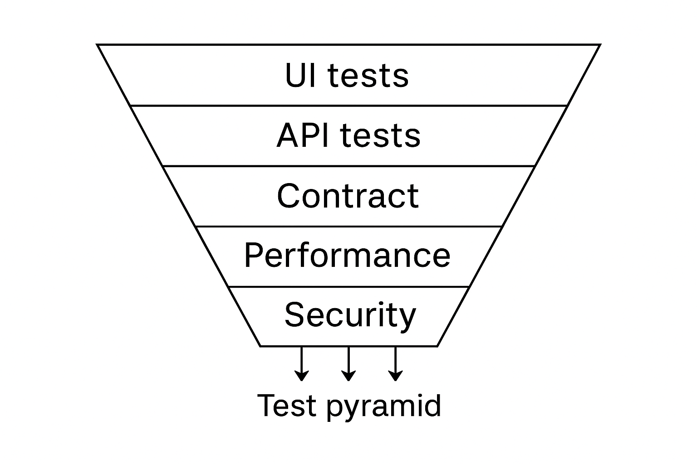

# 🧪 Full-Stack Todo Quality Pipeline

[](https://github.com/Vij5499/Playwright/actions/workflows/playwright.yml)

A minimal **Todo** service + **React UI** wired to a **multi-layer test pipeline**:

| Gate | Tool | Fails build when … |
|------|------|--------------------|
| **UI tests** | Playwright (TypeScript) | any cross-browser assertion fails |
| **API tests** | Playwright Request API | status ≠ 200 or payload mismatch |
| **Contract** | Pact v3 (consumer) | schema drift against provider |
| **Performance** | k6 (10 VU × 30 s) | p(95) ≥ **500 ms** or >1 % errors |
| **Security** | OWASP ZAP Baseline | ≥ **Medium** severity alert |

<p align="center">
  
</p>

---

## 🔧 Quick start (local)

```bash
git clone https://github.com/Vij5499/Playwright.git
cd _<repo-name>_
npm ci                   # install deps
npm run build:api        # compile src/ → dist/
docker build -t todo-api .
docker run --rm -p 3000:3000 todo-api   # API listening
npx playwright test                     # UI + API specs
npx jest --config jest.config.js        # Pact contract
k6 run perf/smoke.js                    # performance smoke
